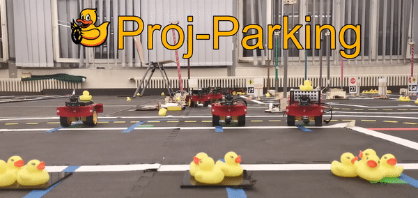

# Parking Area

     

# Setup specifications

Building the Parking Area requries the same [design and environment specifications][duckietown_layout_specs] of building Duckietown itself.
The difference respect to the city layout is that you can add parking spots. To do that you have to use the Parking Spot tile, with the design requirements specified in the image below.

![parking spot tile specifics][spot_spec_tile] 1. Parking spot tile

Another layout requirement you have to respect is the location of the intersection. Since the Parking Area demo has a light version of the intersection navigation where the right turn is hardcoded when the Duckiebot sees the first red stop line, entering the parking lot requires a [T-intersection (figure 2.4)](duckietown_layout_specs) located as in the picture below:

![parking lot example setup][lot_example] 2. Parking lot 

# Run the demo

Running the Parking Area demo requires the same steps of building others Duckietown demos.

Before starting describing the precedure to run the demo, you have to check the following requirements:

* Be sure that dt-core, dt-car-interface, dt-duckiebot-interface, dt-ros-commons images are updated. If not pull them:

    `docker -H $BOTNAME.local pull duckietown/dt-core:daffy-arm32v7`

    `docker -H $BOTNAME .local pull duckietown/dt-car-interface:daffy-arm32v7`

    `docker -H $BOTNAME.local pull duckietown/dt-duckiebot-interface:daffy-arm32v7`

    `docker -H $BOTNAME.local pull duckietown/dt-ros-commons:daffy-arm32v7`

If all the images are updated you can start following the following steps:

1. Make sure all old containers from the images dt-duckiebot-interface, dt-car-interface, and dt-core are stopped. These containers can have different names, instead look at the image name from which they are run.    

2. Start all the drivers in dt-duckiebot-interface:

    `dts duckiebot demo --demo_name all_drivers --duckiebot_name $BOTNAME --package_name duckiebot_interface --image duckietown/dt-duckiebot-interface:daffy`
    
    and the glue nodes that handle the joystick mapping and the kinematics:

    `dts duckiebot demo --demo_name all --duckiebot_name $BOTNAME --package_name car_interface --image duckietown/dt-car-interface:daffy`

3. Be sure that the step 2 worked, then you can **build** the docker container as follows:
    `docker -H $BOTNAME.local build --no-cache -t proj-parking:BRANCH_NAME .`

4. After that if there where no errors, you can **run** the parking demo:

    `docker -H $BOTNAME.local run -it --rm -v /data:/data --privileged --network=host proj-parking:BRANCH_NAME`

5. Start the Joystic and press `a` to start the demo:

    `dts duckiebot keyboard_control $BOTNAME`

:warning: Make sure to change _`$BOTNAME`_ and _`$BRANCH_NAME`_ with your Duckiebot hostname and the branch you are in respectively.

# How to do a perfect parking

The parking demo starts with indefinite navigation. So when it starts the Duckiebot goes just around duckietown. To make it park you have to follow the 

1. Start the `rqt` with the following commands:

    `dts start_gui_tools` _`$BOTNAME`_

    then write `rqt` and press `Enter`.

2. Navigate to `Plugins>Topics>Message Publisher`.
3. Search for the Topic `/`_`$BOTNAME`_`/parking_on` and flag the data to **True**. In this way when the Duckiebot finds the intersection to entering the parking Area, it will recognize it and after crossing the intersection the *Finete State Machine* (FMS) will switch to `PARKING_LANE_FOLLOWING`.
4. After that the Duckiebot will park if there are free parking spots into the Parking lot. 

5. To let the Duckiebot exit, you have to switch to **True** the Topic `/`_`$BOTNAME`_`/parking/time_exiting_parking_spot`. The Duckiebot will switch on the LEDs and after at maximum 80 seconds the exiting maneuver will start.

6. After exiting the Parking Area the FSM will start indefinite navigation, and the Duckiebot will go back to Duckietown.

# Feature improvements
1. Using indefinite navigation, so that the parking lot is completely customizable and there is not the constraint on the intersection.
2. Backward entering to completely avoid crashes.

# Project team

* [Trevor Phillips](https://github.com/trevphil)

* [Linus Lingg](https://github.com/Linus1994)

* [Vincenzo Polizzi](https://github.com/viciopoli01)

[duckietown_layout_specs]:https://docs.duckietown.org/daffy/opmanual_duckietown/out/dt_ops_appearance_specifications.html

[spot_spec_tile]:media/data-from-img-DT19_tile_parking-texture-annotation.png#res
[spot_tile]:media/data-from-img-DT19_tile_parking-texture.png#res

[lot_example]:media/data-from-img-DT19_map_parking-area-texture.png#res
