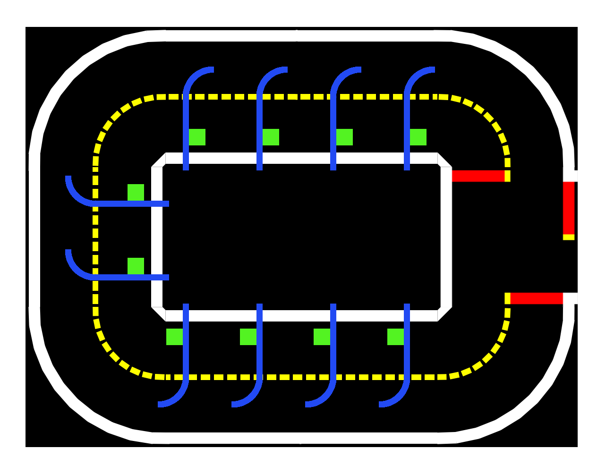

# Proj-Parking

     

## Demonstration

## Setup specifications

Building the parking area requires the same [design and environment specifications][duckietown_layout_specs] as building Duckietown itself.
The difference with respect to the city layout is that you can add parking spots. To do that, you need to use the new "Parking Spot" tile, with the design requirements specified in the image below.

     

<!--![parking spot tile specifics][spot_spec_tile] *figure 1*-->

Another layout requirement you have to respect is the location of the intersection. Since the parking area demo has a lite version of intersection navigation where the right turn is hard-coded when the Duckiebot sees the first red stop line, entering the parking lot requires a [T-intersection (figure 2.4)][duckietown_layout_specs] located as shown in the picture below:

     

<!--![parking lot example setup][lot_example] *figure 2*-->

To let the Duckiebot enter the parking lot, you have to edit the April Tag IDs in the file [random_april_tag_turns_node.py][april_tag_file] according to the April Tags at the intersection of the entrance of your parking area. Be careful, the intersection at the entrance has to be such that the others Duckiebots that are running indefinite navigation will not go into the Parking Area if they are not told to do so. Make sure also that there is an April Tag for the Duckiebots that are leaving the parking lot so that indefinite navgation knows how to behave.

## How to run the demo

Running the parking demo requires similar steps to those of building others Duckietown demos.

Before starting the procedure to run the demo, you have to check the following requirements:

* Be sure that `dt-core`, `dt-car-interface`, `dt-duckiebot-interface`, `dt-ros-commons` images are updated. If not, pull them:

    `docker -H BOTNAME.local pull duckietown/dt-core:daffy-arm32v7`

    `docker -H BOTNAME .local pull duckietown/dt-car-interface:daffy-arm32v7`

    `docker -H BOTNAME.local pull duckietown/dt-duckiebot-interface:daffy-arm32v7`

    `docker -H BOTNAME.local pull duckietown/dt-ros-commons:daffy-arm32v7`

If all the images are updated you can start the following steps:

1. Make sure all old containers from the images `dt-duckiebot-interface`, `dt-car-interface`, and `dt-core` are stopped. These containers can have different names, instead look at the image name from which they are run.    

2. Start all the drivers in `dt-duckiebot-interface`:

    `dts duckiebot demo --demo_name all_drivers --duckiebot_name BOTNAME --package_name duckiebot_interface --image duckietown/dt-duckiebot-interface:daffy`
    
    and the glue nodes that handle the joystick mapping and the kinematics:

    `dts duckiebot demo --demo_name all --duckiebot_name BOTNAME --package_name car_interface --image duckietown/dt-car-interface:daffy`

3. Be sure that step 2 worked, then you can **build** the docker container as follows:
    `docker -H BOTNAME.local build --no-cache -t proj-parking:BRANCH_NAME .`

4. After that, if there were no errors, you can **run** the parking demo:

    `docker -H BOTNAME.local run -it --rm -v /data:/data --privileged --network=host proj-parking:BRANCH_NAME`

5. Start the Joystick and press `a` to start the demo:

    `dts duckiebot keyboard_control BOTNAME`

:warning: Make sure to change _`BOTNAME`_ and _`BRANCH_NAME`_ with your Duckiebot hostname and the branch you are in, respectively.

:bulb: To avoid writing all the commands described above you can use our corresponding [scripts][scripts]. :warning: Remember to change the _`BOTNAME`_ in each of them. 

## How to park perfectly

The parking demo starts with indefinite navigation. So when it starts, the Duckiebot goes just around Duckietown. To make it park you have to follow these steps:

1. Start `rqt` with the following commands:

    `dts start_gui_tools $BOTNAME`

    then type `rqt` and press `Enter`.

2. Navigate to `Plugins>Topics>Message Publisher`.
3. Search for the Topic `/BOTNAME/parking_on` and flag the topic to **True**. In this way, when the Duckiebot finds the intersection to enter the parking area, it will recognize it and after crossing the intersection, the *Finite State Machine* (FSM) will switch to `PARKING_LANE_FOLLOWING`.
4. After that, the Duckiebot will park if there are free parking spots into the parking area.
5. To let the Duckiebot exit, you have to switch to **True** the topic `/BOTNAME/parking/time_exiting_parking_spot`. The Duckiebot will switch on its LEDs and after a maximum of 80 seconds, the exiting maneuver will start.

6. After turning right at the parking area intersection the FSM will start indefinite navigation again, and the Duckiebot will go back to Duckietown.

## Future improvements
There are many improvements that can be done, such as:

1. Using indefinite navigation, so that the parking lot is completely customizable and there is not a constraint on the intersection
2. Backwards entering to completely avoid crashes
3. Using April Tags for localization and closed-loop control during the parking maneuver

## Troubleshooting

Something went wrong during the demo? We can probably help you! These are the problems we had, if you don't find the answer to you problem, try to ask in [Duckietown Slack channel][duckietown_slack]. 

### Building and Running
1. If your Duckiebot does not yield satisfactory results in intersection navigation have a look to this guide [**Intersection troubleshooting**][intersection_trouble], there you can find how to tune the parameters to have goods turns (note that this is not part of the parking node).
2. In case you have errors regarding the LED patterns or related to ROS, be sure you have updated the docker images as explained in the section [**How to run the demo**](#how-to-run-the-demo).
3. If you cannot control your Duckiebot with the Joystick or the demo doesn't start after pressing `a`, be sure you are running the demos. To check it, go to portainer (http://BOTNAME.local:9000). The containers `demo_all` and `demo` have to appear there. If you cannot access portainer, have a look at docker by running `docker -H $BOTNAME.local ps`.
### Parking maneuver
1. If the backward exit doesn't work properly, make the blue tape just 4-5 centimeters longer (extending past the white line) so that it can be seen by the Duckiebot when it is parked.
2. If the Duckiebot stops too close/far from the white line, change the cropping of the image [in the white line detector][white_line].
3. If the Duckiebot stops too close/far from the red line change the cropping of the image [in the red line detector][red_line].
4. If the backward left turn is too much or not enough change the duration of the [turn][turn_duration].
5. if the Duckiebot starts turning too early/late during the exiting maneuver change the exiting [cropping of the image][crop_green_exit].
6. If the Duckiebot doesn't detect free parking spots, or if it sees them even they are taken, adapt the [searching cropping][crop_green].
7. If the vehicle pose after parking is not satisfying with respect to the blue line, change the [d-offset][d_offset].
8. If the blob detection has too many false positives/negatives tune [these parameters][parameters_blob]. Please note that the `WHITE_THRESHOLD` is the crucial parameter but it is very sensitive to small changes.

## Lite parking version

If you want to test just the parking area, you can use a light version of the project that is in the branch [**v1-testable**][v1_testable]. This version doesn't use indefinite navigation and the Duckiebot leaves the parking spot automatically after 5 seconds. 

The procedure to build and run the demo is the same illustrated in the section [**How to run the demo**](#how-to-run-the-demo). The demo will start just after the intersection in Duckietown to enter the parking lot.

In other words, the parking node is active by default when this version is run, and as soon as the Duckiebot detects a red line, it will take a right turn and begin searching for parking. 

 :warning: If you want to reset the parking state to `ENTERING_PARKING_LOT`, you need to publish **True** for a few seconds to the topic `/BOTNAME/parking/start_from`.

## Team

### Students

* [Trevor Phillips](https://github.com/trevphil)
* [Linus Lingg](https://github.com/Linus1994)
* [Vincenzo Polizzi](https://github.com/viciopoli01)

### Mentors
* Tomasz Zaluska
* Gioele Zardini

### Supervisor
* Jacopo Tani

[scripts]:https://github.com/duckietown-ethz/proj-parking/tree/v1/scripts

[v1_testable]:https://github.com/duckietown-ethz/proj-parking/tree/v1-testable

[duckietown_layout_specs]:https://docs.duckietown.org/daffy/opmanual_duckietown/out/dt_ops_appearance_specifications.html "Duckietown design and environment specifications"

[spot_spec_tile]:media/data-from-img-DT19_tile_parking-texture-annotation.png#res
[spot_tile]:media/data-from-img-DT19_tile_parking-texture.png#res "Parking tile design specifications"

[lot_example]:media/data-from-img-DT19_map_parking-area-texture.png#res "Parking area layout example"

[april_tag_file]: https://github.com/duckietown-ethz/proj-parking/blob/v1/packages/navigation/src/random_april_tag_turns_node.py#L113-L118

[duckietown_slack]: https://join.slack.com/t/duckietown/shared_invite/enQtNTU0Njk4NzU2NTY1LWM2YzdlNmJmOTg4MzAyODc2YTI3YTc5MzE2MThkZGUwYTFkZWQ4M2ZlZGU1YTZhYjg5YTgzNDkyMzI2ZjNhZWE

[intersection_trouble]: https://docs.duckietown.org/daffy/opmanual_duckiebot/out/trouble_unicorn_intersection.html

[white_line]:https://github.com/duckietown-ethz/proj-parking/blob/v1/packages/parking/src/white_line_detection.py#L26

[red_line]:https://github.com/duckietown-ethz/proj-parking/blob/v1/packages/parking/src/red_line_detection.py#L24

[turn_duration]:https://github.com/duckietown-ethz/proj-parking/blob/v1/packages/parking/src/parking.py#L393

[crop_green_exit]:https://github.com/duckietown-ethz/proj-parking/blob/v1/packages/parking/src/free_parking_detection.py#L29

[crop_green]:https://github.com/duckietown-ethz/proj-parking/blob/v1/packages/parking/src/free_parking_detection.py#L30

[d_offset]:https://github.com/duckietown-ethz/proj-parking/blob/v1/packages/parking/src/parking.py#L372

[parameters_blob]:https://github.com/duckietown-ethz/proj-parking/blob/v1/packages/parking/src/led_detection.py#L26-L31
